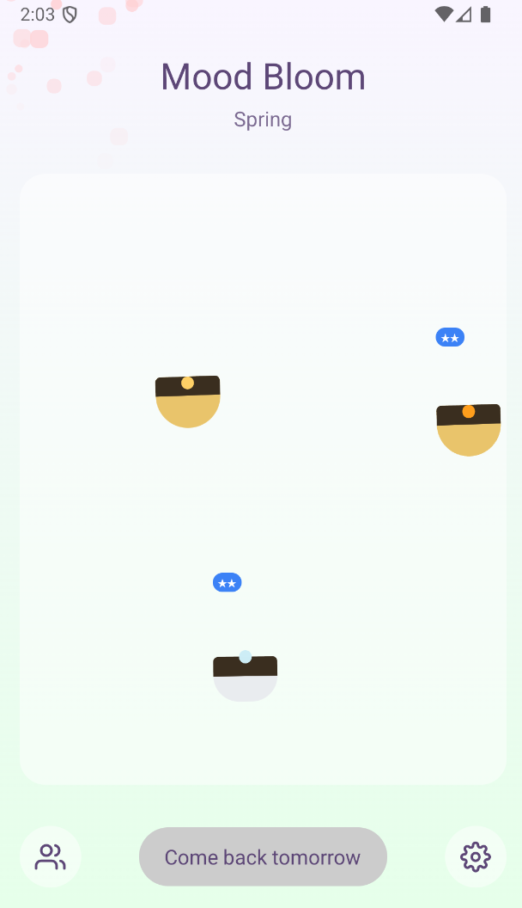
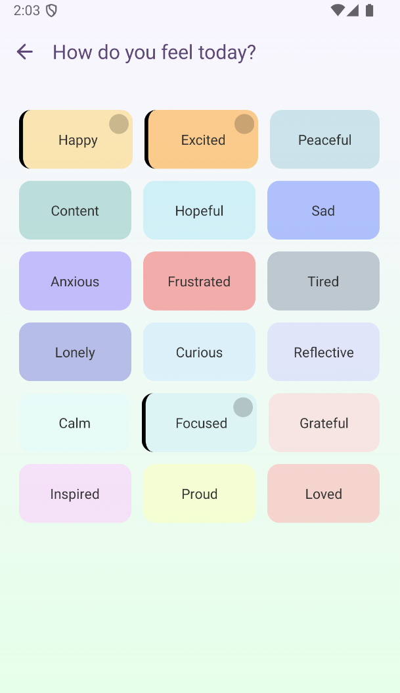
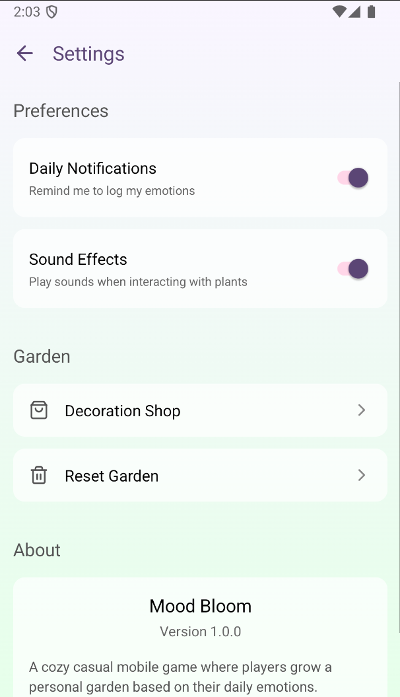

# 📱 แบบฟอร์มส่งงานสอบ Take-home | Take-home Assignment Template
**ชื่อ - นามสกุล (Full Name):** Gritthaphat Chalermpong  
**รหัสนักศึกษา (Student ID):** 6631503001  
**ชื่อแอป (App Name):** Mood Bloom  
**Framework ที่ใช้ (Framework Used):** React Native  
**ลิงก์ GitHub Repository:** [https://github.com/6631503001/Mood-Bloom]  
**ลิงก์ไฟล์ติดตั้ง (APK/IPA):** [ใส่ลิงก์ที่นี่ | Insert link here]  

---

## 1. การออกแบบแอป | App Concept and Design (2 คะแนน / 2 pts)

### 1.1 ผู้ใช้งานเป้าหมาย | User Personas  
```markdown
Persona 1:  
- ชื่อ: นัท  
- อายุ: 20 ปี  
- อาชีพ: นักศึกษาปี 2  
- ความต้องการ: ต้องการบันทึกอารมณ์ในแต่ละวันเพื่อทำสถิติสุขภาพจิตของตัวเอง

Persona 2:  
- ชื่อ: พลอย  
- อายุ: 17 ปี  
- อาชีพ: นักเรียน  
- ความต้องการ: ต้องการแอพพลิเคชั่นเอาไว้เล่นเพลินๆกับเพื่อน
```

### 1.2 เป้าหมายของแอป | App Goals  
```markdown
- แสดงผลอารมณ์รายวันโดยใช้ต้นไม้เป็นตัวแทน  
- สามารถดูป่า (อารมณ์โดยรวม) ของเพื่อนได้  
```

### 1.3 โครงร่างหน้าจอ / Mockup  
**ใส่รูปภาพ หรือคำอธิบายแต่ละหน้าหลัก 3 หน้า | Attach image or describe 3 main pages**  

### 1.4 การไหลของผู้ใช้งาน | User Flow  
  

---

## 2. การพัฒนาแอป | App Implementation (4 คะแนน / 4 pts)

### 2.1 รายละเอียดการพัฒนา | Development Details  
**เครื่องมือที่ใช้ / Tools used:**  
```markdown
- React-native 0.76.9  
- Typescript  
- Package: Node Package Management  
```

### 2.2 ฟังก์ชันที่พัฒนา | Features Implemented  
**Checklist:**  
```markdown
- [x] โชว์ต้นไม้  
- [x] บันทึกอารมณ์ในแต่ละวัน  
```

### 2.3 ภาพหน้าจอแอป | App Screenshots  
**แนบภาพหรือ URL (Attach images or image links):**  
  
  
  

---

## 3. การ Build และติดตั้งแอป | Deployment (2 คะแนน / 2 pts)

### 3.1 ประเภท Build | Build Type  
- [x] Debug  
- [ ] Release  

### 3.2 แพลตฟอร์มที่ทดสอบ | Platform Tested  
- [x] Android  
- [ ] iOS  

### 3.3 ไฟล์ README และวิธีติดตั้ง | README & Install Guide  
**แนบไฟล์หรือคำอธิบายการติดตั้งแอป | Insert steps**  
```markdown
1. ดาวน์โหลดไฟล์ .apk  
2. เปิดในอุปกรณ์ Android  
3. ติดตั้งผ่าน File Manager  
```

---

## 4. การสะท้อนผลลัพธ์ | Reflection (2 คะแนน / 2 pts)

```markdown
- บางครั้งใช้ useState เพื่อเปลี่ยน state บางอย่างแล้วอาจเกิด infinite loop ได้  
- เรียนรู้การใช้ animation  
- หากมีเวลา จะแก้บัคและทำให้ UI สวยกว่านี้  
```

---

## 5. การใช้ AI ช่วยพัฒนา | AI Assisted Development (Bonus / ใช้ประกอบการพิจารณา)

### 5.1 ใช้ AI ช่วยคิดไอเดีย | Idea Generation  
```markdown
Prompt ที่ใช้:  
"ขอไอเดีย UI และระบบสำหรับแอพปลูกต้นไม้โดยใช้อารมณ์เป็นการรดน้ำชื่อ Mood Bloom"  

ผลลัพธ์:  
ได้ไอเดียแอปและ UI คร่าวๆ  
```

### 5.2 ใช้ AI ช่วยออกแบบ UI | UI Layout Prompt  
```markdown
Prompt ที่ใช้:  
"Design a expo (React Native) for the *description of the app*"  

ผลลัพธ์:  
ได้ code structure ของ Mood Bloom 5 หน้า  
```

### 5.3 ใช้ AI ช่วยเขียนโค้ด | Code Writing Prompt  
```markdown
Prompt ที่ใช้:  
"add a dashboard page that can show user's plant progress"  

ผลลัพธ์:  
ได้หน้า dashboard ของแอพ  
```

### 5.4 ใช้ AI ช่วย debug | Debug Prompt  
```markdown
Prompt ที่ใช้:  
"I can't find mention of crypto property"  

ผลลัพธ์:  
AI แนะนำให้ตรวจสอบ trace stack และวิธีแก้ไข  
```

### 5.5 ใช้ AI ช่วย Deploy | Deployment Prompt  
```markdown
Prompt ที่ใช้:  
"How to config eas.json to build an apk app?"  

ผลลัพธ์:  
config เพื่อใส่ใน eas.json เพื่อ build apk  
```

---

## ✅ Checklist ก่อนส่ง | Final Checklist  
- [x] กรอกข้อมูลครบทุก Section  
- [x] แนบ GitHub และไฟล์ติดตั้ง  
- [x] สะท้อนผล และใช้ AI อย่างมีเหตุผล  